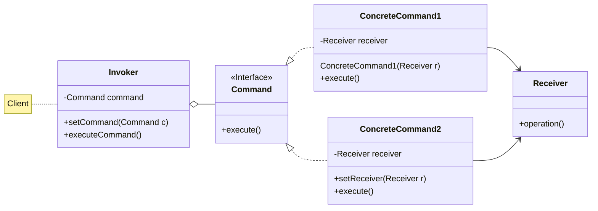
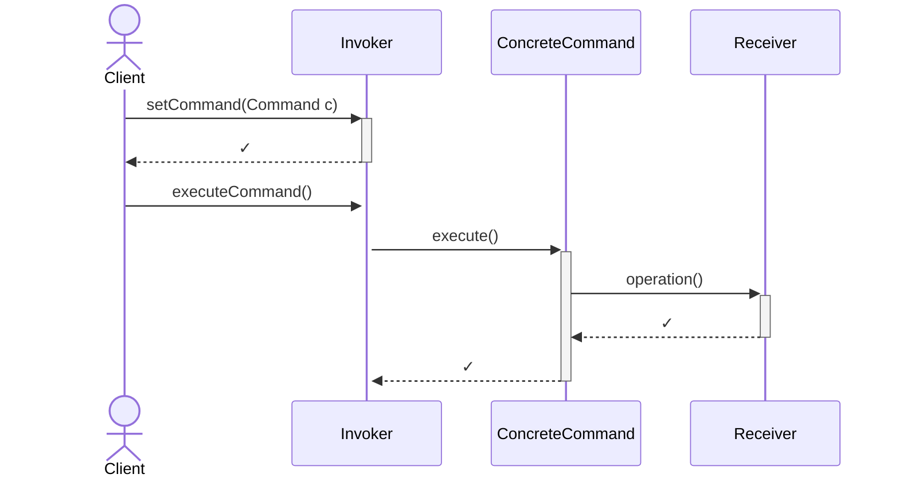
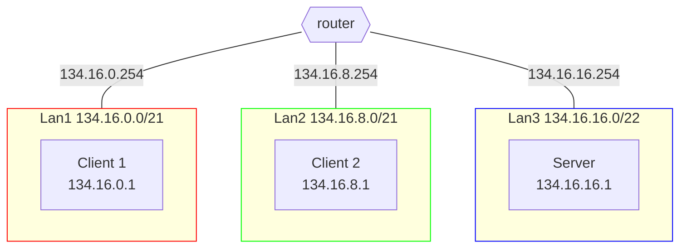
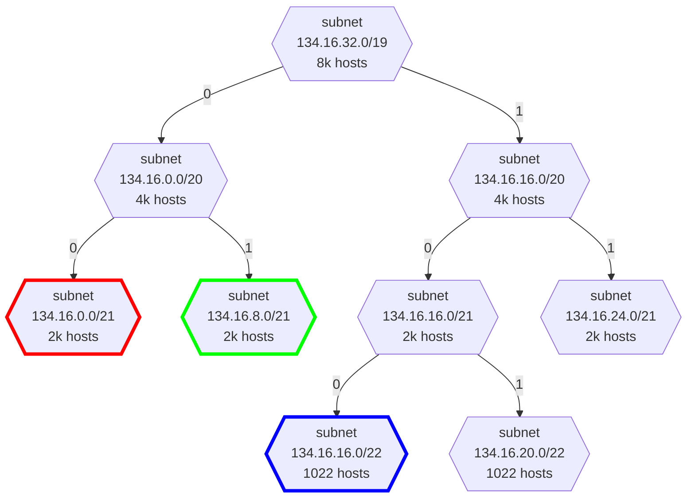

# Markdown

<!-- New section -->

## Introduction

This repository contains a template for presentation meant to be shown during tutoring sessions.  
The core of the template is a [reveal.js](https://revealjs.com/) presentation, extended with [MathJax](https://www.mathjax.org/) and [mermaid](https://mermaid-js.github.io/mermaid/#/) support.
To keep everything compatible, some custom CSS and JS files were also added.

The core idea is to make it easy to write presentations in markdown, meaning it is possible to view them easily with the GitHub preview, while also providing some more interactive slides.  
This means that the markdown syntax follows the same rules as the one used by [GitHub](https://guides.github.com/features/mastering-markdown/), with some extra features on top.  
What follows is a series of examples to show the additions.

<!-- New section -->

## Slide management

To add a new section, meaning a new slide deck, just add `<!-- New section -->` to the markdown file.
Since it is a comment, it will not be shown in the markdown preview.

To add a sub-section, meaning a new slide under the current one, just add `<!-- New subsection -->` to the markdown file.

<!-- New subsection -->

### Fragments

To add a fragment, meaning something not shown immediately.

They appears when navigating the slides. Just add `<!-- .element: class="fragment" -->` under the element you want to make a fragment.

<!-- .element: class="fragment" data-fragment-index="1" -->

just add `data-fragment-index="n"` to all of them, where `n` is the order in which they should appear, or the same number for all of them if they should appear at the same time.

<!-- .element: class="fragment" data-fragment-index="3" -->

If multiple elements are to appear at the same time or out of order...

<!-- .element: class="fragment" data-fragment-index="2" -->

<!-- New section -->

## Columns

<div class="cols">

To add columns, just add `<div class="cols">` before the first column and `</div>` after the last one.

Each element enclosed in a `<div>` will be a column.

Try to keep the number of columns low, as they will be resized to fit the screen.

</div>

<!-- New section -->

## Code

To add code, just add a fenced code block with the language specified.

<div class="cols">

    ```python
    def hello_world():
        print("Hello world!")
    ```

```python
def hello_world():
    print("Hello world!")
```

</div>

The language highlighting is done with [highlight.js](https://highlightjs.org/), so check their documentation for the supported languages.

<!-- New section -->

## Math

This template uses [MathJax](https://www.mathjax.org/) to render math blocks as SVGs.

There are multiple ways to include math in the slides.  
The most straightforward one is to use the `$` inline delimiter, like `\$\frac{1}{2}$` renders $\frac{1}{2}$.

<!-- New subsection -->

### Math blocks ($)

To add a math block, just add `$$` before and after the block.

```latex
$$
\sum_{i=1}^n i = \frac{n(n+1)}{2} \tag{first n sum}
$$
```

$$
\sum_{i=1}^n i = \frac{n(n+1)}{2} \tag{first n sum}
$$

<!-- New subsection -->

### Math blocks (code block)

Another way to add a math block that will be correctly escaped on the GitHub markdown renderer is to used a math code block ([see here](https://github.com/orgs/community/discussions/65772)).

    ```math
    \underbrace{192}_{8\ bit}.\underbrace{168}_{8\ bit}.\underbrace{1}_{8\ bit}.\underbrace{1}_{8\ bit}
    ```

```math
\underbrace{192}_{8\ bit}.\underbrace{168}_{8\ bit}.\underbrace{1}_{8\ bit}.\underbrace{1}_{8\ bit}
```

<!-- New section -->

## Diagrams

Using the [mermaid](https://mermaid-js.github.io/mermaid/#/) library, it is possible to use its declarative sintax to embed diagrams in the slides.

<!-- New subsection -->

### Class UML

Command design pattern



<!-- New subsection -->

### Sequence diagram

Command design pattern



<!-- New subsection -->

### Flowchart

Network topology



<!-- New subsection -->

## Graph

Ipv4 subdivision tree



<!-- New section -->

## QR code

To add a QR code, just add the `<qrcode />` html element.
It will also be clickable and redirect to teh specified url.

<qrcode dark="#0f0" light="#00f" />

<!-- New subsection -->

### QR code attributes

It supports the following attributes:

- **url**: the url to encode. Defaults to the current page url
- **size**: the size of the QR code in pixels. Defaults to 128
- **align**: the alignment of the QR code, can be `left`, `center` or `right`. Defaults to `center`
- **dark**: the color of the dark squares. Defaults to `#000`
- **light**: the color of the light squares. Defaults to `#fff`
